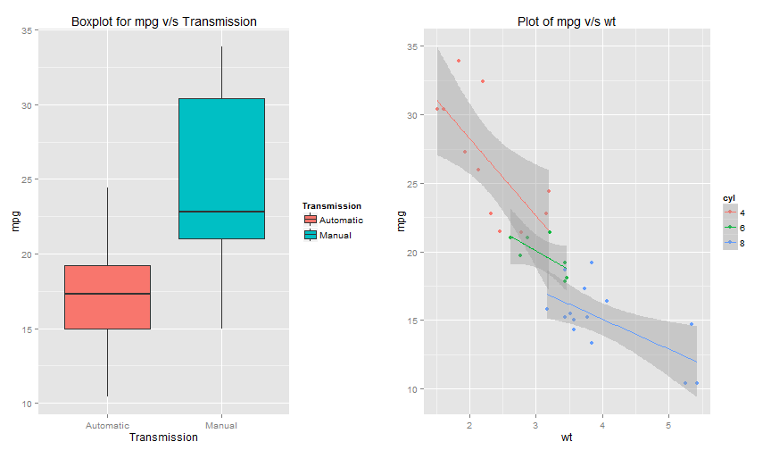
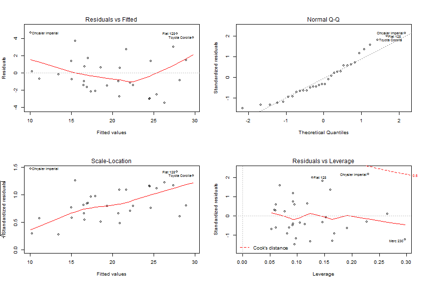

Motor Trend, a magazine for the automative industry is interested in exploring the relationship between a set of variables and miles per gallon (mpg) as the outcome. They are interested in the following questions, 
- "Is an automatic or manual transmission better for MPG"
- "Quantify the MPG difference between automatic and manual transmissions"

Given is a dataset named mtcars, the goal here is to develop a model with explains the relationship between the variables and mpg. We will build multiple regression models and select the one which has the best outcome.


```r
# Loading the required libraries
library(ggplot2)
library(datasets)
library(gridExtra)

#Loading the dataset
data(mtcars)

#Converting the numeric variables to factors
mtcars$cyl <- as.factor(mtcars$cyl)
mtcars$vs <- as.factor(mtcars$vs)
mtcars$am <- as.factor(mtcars$am)
mtcars$gear <- as.factor(mtcars$gear)
mtcars$carb <- as.factor(mtcars$carb)
names(mtcars)[9] <- "Transmission"
levels(mtcars$Transmission) <- c("Automatic","Manual")
```


```r
#Regression Model-1 : mpg as outcome and 'am' as the variable
fit_am <- lm(mpg ~ Transmission, data=mtcars)
summary(fit_am)
```

```
## 
## Call:
## lm(formula = mpg ~ Transmission, data = mtcars)
## 
## Residuals:
##     Min      1Q  Median      3Q     Max 
## -9.3923 -3.0923 -0.2974  3.2439  9.5077 
## 
## Coefficients:
##                    Estimate Std. Error t value Pr(>|t|)    
## (Intercept)          17.147      1.125  15.247 1.13e-15 ***
## TransmissionManual    7.245      1.764   4.106 0.000285 ***
## ---
## Signif. codes:  0 '***' 0.001 '**' 0.01 '*' 0.05 '.' 0.1 ' ' 1
## 
## Residual standard error: 4.902 on 30 degrees of freedom
## Multiple R-squared:  0.3598,	Adjusted R-squared:  0.3385 
## F-statistic: 16.86 on 1 and 30 DF,  p-value: 0.000285
```

- In this model, the transmission variable is significant as expected with a p-value of 0.000285. However, this model fails to explain the variance and explains only 33.8% of it. We now try to find a better model and include all variables.


```r
#Regression Model-2 : mpg as outcome with all input variables
fit_all <- lm(mpg ~ ., data=mtcars)
summary(fit_all)
```

```
## 
## Call:
## lm(formula = mpg ~ ., data = mtcars)
## 
## Residuals:
##     Min      1Q  Median      3Q     Max 
## -3.5087 -1.3584 -0.0948  0.7745  4.6251 
## 
## Coefficients:
##                    Estimate Std. Error t value Pr(>|t|)  
## (Intercept)        23.87913   20.06582   1.190   0.2525  
## cyl6               -2.64870    3.04089  -0.871   0.3975  
## cyl8               -0.33616    7.15954  -0.047   0.9632  
## disp                0.03555    0.03190   1.114   0.2827  
## hp                 -0.07051    0.03943  -1.788   0.0939 .
## drat                1.18283    2.48348   0.476   0.6407  
## wt                 -4.52978    2.53875  -1.784   0.0946 .
## qsec                0.36784    0.93540   0.393   0.6997  
## vs1                 1.93085    2.87126   0.672   0.5115  
## TransmissionManual  1.21212    3.21355   0.377   0.7113  
## gear4               1.11435    3.79952   0.293   0.7733  
## gear5               2.52840    3.73636   0.677   0.5089  
## carb2              -0.97935    2.31797  -0.423   0.6787  
## carb3               2.99964    4.29355   0.699   0.4955  
## carb4               1.09142    4.44962   0.245   0.8096  
## carb6               4.47757    6.38406   0.701   0.4938  
## carb8               7.25041    8.36057   0.867   0.3995  
## ---
## Signif. codes:  0 '***' 0.001 '**' 0.01 '*' 0.05 '.' 0.1 ' ' 1
## 
## Residual standard error: 2.833 on 15 degrees of freedom
## Multiple R-squared:  0.8931,	Adjusted R-squared:  0.779 
## F-statistic:  7.83 on 16 and 15 DF,  p-value: 0.000124
```

- In this regression model, we include all variables. This model does explain the variance better (77.9%) but doesn't have any significant variable. We will try to change the model and find the significant variables with the backward selection technique.


```r
#Regression Model-3 : Backward selection to identify the significant variables
fit_back <- step(fit_all, k=log(nrow(mtcars)))
```


```r
summary(fit_back)
```

```
## 
## Call:
## lm(formula = mpg ~ wt + qsec + Transmission, data = mtcars)
## 
## Residuals:
##     Min      1Q  Median      3Q     Max 
## -3.4811 -1.5555 -0.7257  1.4110  4.6610 
## 
## Coefficients:
##                    Estimate Std. Error t value Pr(>|t|)    
## (Intercept)          9.6178     6.9596   1.382 0.177915    
## wt                  -3.9165     0.7112  -5.507 6.95e-06 ***
## qsec                 1.2259     0.2887   4.247 0.000216 ***
## TransmissionManual   2.9358     1.4109   2.081 0.046716 *  
## ---
## Signif. codes:  0 '***' 0.001 '**' 0.01 '*' 0.05 '.' 0.1 ' ' 1
## 
## Residual standard error: 2.459 on 28 degrees of freedom
## Multiple R-squared:  0.8497,	Adjusted R-squared:  0.8336 
## F-statistic: 52.75 on 3 and 28 DF,  p-value: 1.21e-11
```

- With the backward technique, we have identified the variables wt, qsec and Transmission type as the significant variables. This model also explains most of the variance (83.3%). We will select this regression model for quantifying the mpg difference. 

### "Is an automatic or manual transmission better for MPG"
 - As per out third model, we expect a *improvement* in mpg with manual transmission. The boxplot also shows that the mean mpg for manual is better than the mean mpg for automatic transmission.
 
### "Quantify the MPG difference between automatic and manual transmissions"
 - While selecting the 3rd model, the difference in mpg for manual transmission and automatic transmission is 2.93 mpg ( Here the weight wt(lbs/1000) and qsec is kept constant).
 
### Figures:


```r
# Plot for the relation between mpg and Transmission
g <- ggplot(mtcars, aes(x=Transmission, y=mpg))
g <- g + geom_boxplot(aes(fill=Transmission))
g <- g + labs(title = "Boxplot for mpg v/s Transmission")

g2 <- ggplot(mtcars, aes(x=wt, y=mpg))
g2 <- g2 + geom_point(aes(colour=cyl))
g2 <- g2 + geom_smooth(method=lm, aes(colour=cyl))
g2 <- g2 + labs(title="Plot of mpg v/s wt")

grid.arrange(g, g2, ncol=2)
```

 


```r
# Plot for for final selection model
par(mfrow = c(2,2))
plot(fit_back)
```

 
