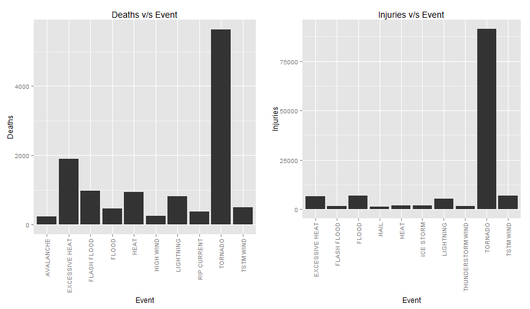
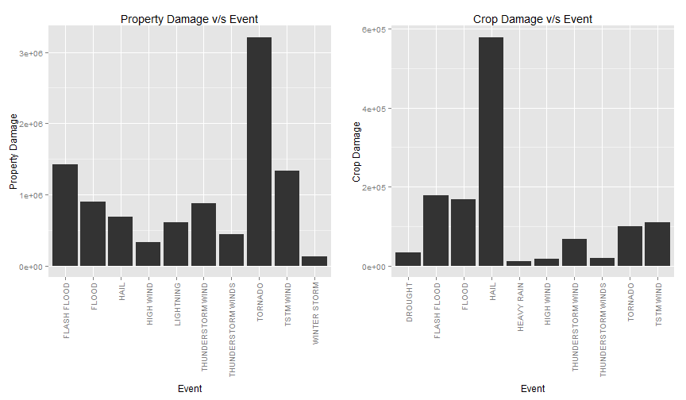

## The analysis provides an insight to the effect of natural calamities on US public health and economy. The data is collected from various sources all accross US from 1950's to 2011. 985 types of natural causes are incorporated in the dataset. 

## The analysis shows that Texas state is most impacted. Tornadoes are the main cause for deaths and injuries while hail cause the maximum damage to economy. 

### 1. Across the United States, which types of events (as indicated in the EVTYPE variable) are most harmful with respect to population health?


```r
library(ggplot2)
library(dplyr)
library(gridExtra)
data(state)

#Reading the data and transforming using the dplyr package
setwd("~/")
data <- read.csv(bzfile("repdata-data-StormData.csv.bz2"))
raw <- tbl_df(data)
by_event <- group_by(raw, EVTYPE)
deaths <- summarize(by_event, Deaths = sum(FATALITIES), Injuries = sum(INJURIES))

top_10_deaths <- arrange(deaths, desc(Deaths))[1:10,]
top_10_injuries <- arrange(deaths, desc(Injuries))[1:10,]

# Plotting the graphs for health impact v/s event type
g1 <- ggplot(top_10_deaths, aes(x=EVTYPE, y=Deaths))
        g1 <- g1 + geom_bar(stat="identity")
        g1 <- g1 + theme(axis.text.x = element_text(angle = 90, hjust = 1, vjust=0.5))
        g1 <- g1 + labs(x="Event", y="Deaths", title="Deaths v/s Event")

g2 <- ggplot(top_10_injuries, aes(x=EVTYPE, y=Injuries))
        g2 <- g2 + geom_bar(stat="identity")
        g2 <- g2 + theme(axis.text.x = element_text(angle = 90, hjust = 1, vjust=0.5))
        g2 <- g2 + labs(x="Event", title="Injuries v/s Event")

grid.arrange(g1, g2, ncol=2)
```

 

- It can be clearly visualized by the plots that **tornadoes** are most harmful for human health in terms of deaths as well as injuries.

### 2. Across the United States, which types of events have the greatest economic consequences?


```r
#Transforming the data in the desired format using the dplyr package
economy_stats <- summarize(by_event, Property = sum(PROPDMG), Crop = sum(CROPDMG))
        top_10_propdmg <- arrange(economy_stats, desc(Property))[1:10,]
        top_10_cropdmg <- arrange(economy_stats, desc(Crop))[1:10,]

# Plotting the graphs for economy damage v/s event type
g3 <- ggplot(top_10_propdmg, aes(x=EVTYPE, y=Property))
        g3 <- g3 + geom_bar(stat="identity")
        g3 <- g3 + theme(axis.text.x = element_text(angle = 90, hjust = 1, vjust=0.5))
        g3 <- g3 + labs(x="Event", y="Property Damage", title="Property Damage v/s Event")

g4 <- ggplot(top_10_cropdmg, aes(x=EVTYPE, y=Crop))
        g4 <- g4 + geom_bar(stat="identity")
        g4 <- g4 + theme(axis.text.x = element_text(angle = 90, hjust = 1, vjust = 0.5))
        g4 <- g4 + labs(x="Event", y="Crop Damage", title="Crop Damage v/s Event")

grid.arrange(g3, g4, ncol=2)
```

 

- It can be clearly visualized from the plots that *Tornadoes* cause maximum damage to property and **Hail** cause maximum damage to crops.

### 3. Which states have the maximum impact of the natural calamities? (Extra Question)


```r
map <- map_data("state")

#Transforming the data in the desired format using the dplyr package
by_state <- group_by(raw, STATE)
deaths_by_state <- summarize(by_state, Deaths = sum(FATALITIES), Injuries = sum(INJURIES))
map$region <- state.abb[match(map$region, tolower(state.name))]
combined <- merge(map, deaths_by_state, by.x="region", by.y="STATE")

#Plotting the graphs
g5 <- ggplot(combined, aes(x=long, y=lat))
        g5 <- g5 + geom_polygon(aes(fill=Deaths, group=group))
        g5 <- g5 + labs(title="Deaths by State")

g6 <- ggplot(combined, aes(x=long, y=lat))
        g6 <- g6 + geom_polygon(aes(fill=Injuries, group=group))
        g6 <- g6 + labs(title="Injuries by State")

grid.arrange(g5, g6, ncol=2)
```

 

- It can be seen from the map that **Texas** has the highest casualties and injuries from natural events.
